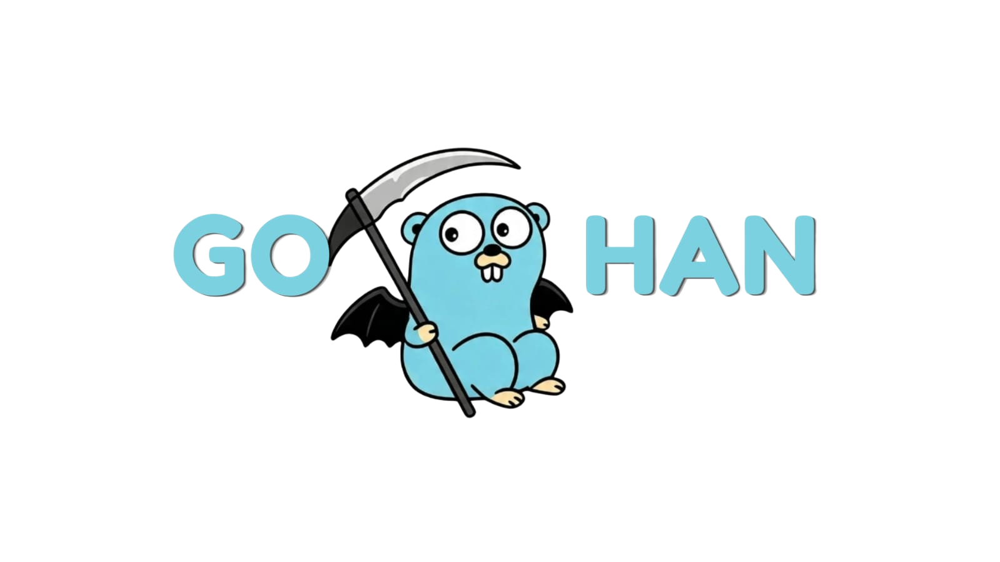

<p align="center">
    
    <br><br>
    
    
    
    
    
</p>

## About Gohan

**Gohan** is a flexible, high-performance web framework designed for Go developers who value speed, architectural consistency, and seamless end-to-end development. Built to support both **API-only microservices** and **full-stack applications**, Gohan bridges the gap between robust backend craftsmanship and modern user interfaces.

Currently, Gohan provides an out-of-the-box full-stack workflow powered by a lightweight Go core, RESTful API architecture, **Vue 3, Tailwind CSS, and TanStack Query**. By eliminating repetitive boilerplate, automated routing setups, and complex state synchronization, Gohan empowers developers to scaffold, build, and deploy production-ready applications in minutes.

### 🚀 Built for Today, Ready for Tomorrow
Gohan is designed with a modular, protocol-agnostic mindset. While currently optimized for REST APIs and Vue 3, the ecosystem is actively evolving to support a broader set of technologies, including:
* **Protocols & APIs**: gRPC and GraphQL support for high-throughput and dynamic data fetching.
* **Frontend Ecosystem**: Multi-frontend CLI templates, including **React** integration.

## Getting Started

### 1. Install Go

Follow the official installation guide on the <a href="https://go.dev/doc/install">Go Website</a>.

### 2. Install Node.js & NPM

Follow the official installation guide on the <a href="https://nodejs.org/en/download">Node</a>.

### 3. Install Gohan CLI

Install the latest LTS release:
```bash
go install github.com/farkhanisturkia/gohan/cmd/gohan@v1.9.2
```
A command-line tool `gohan` will be built into `$GOPATH/bin/`.

### 4. Basic CLI Usage

Check available commands and options:
```bash
gohan -h
```

Check installed Gohan CLI version:
```bash
gohan -v
```

Create a new Gohan project:
```bash
gohan init
```